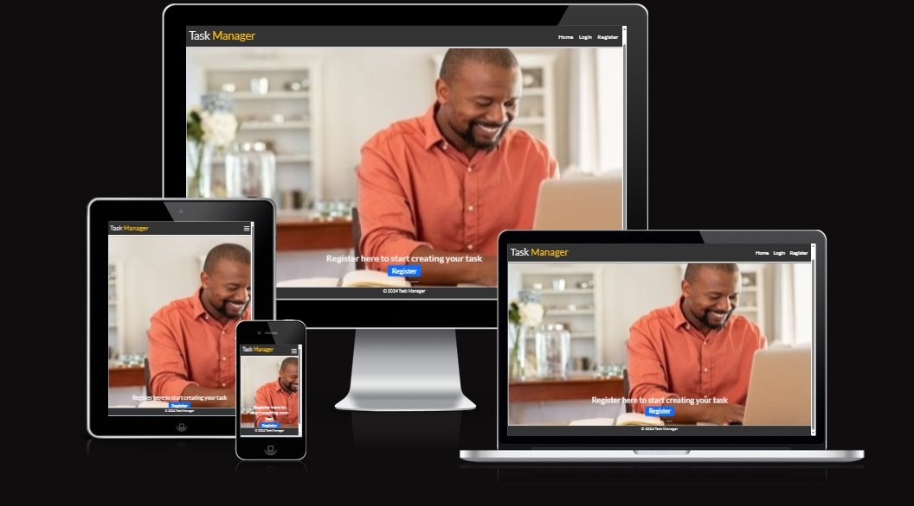
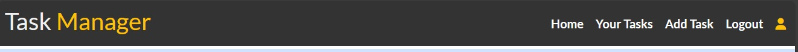
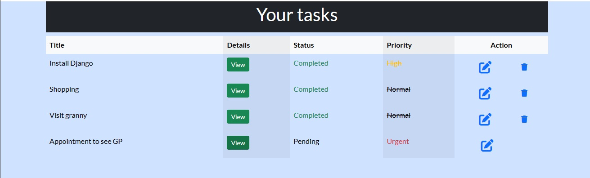
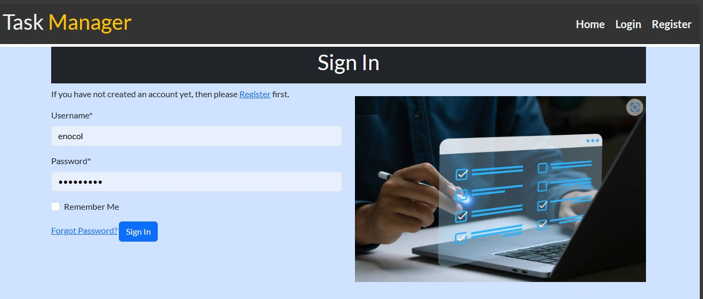
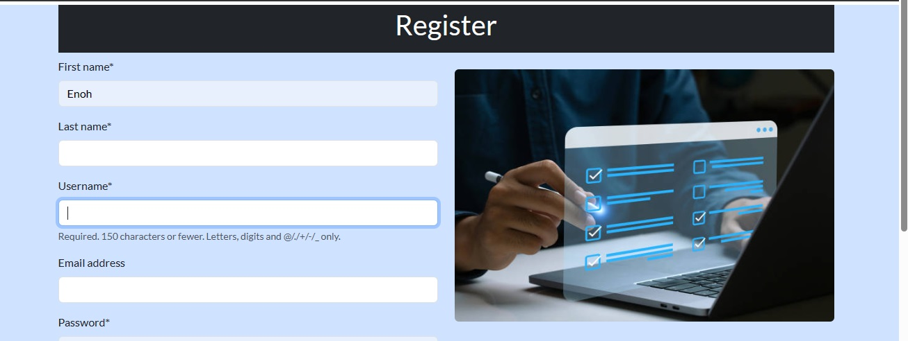
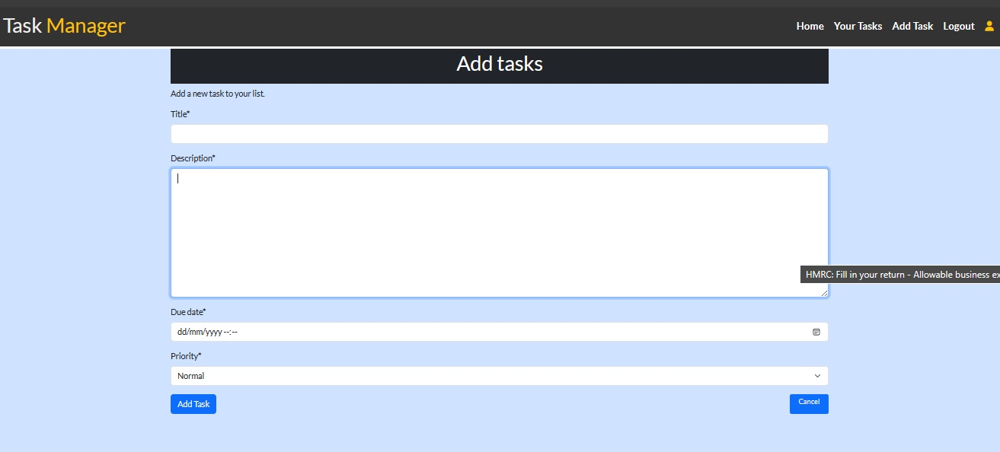
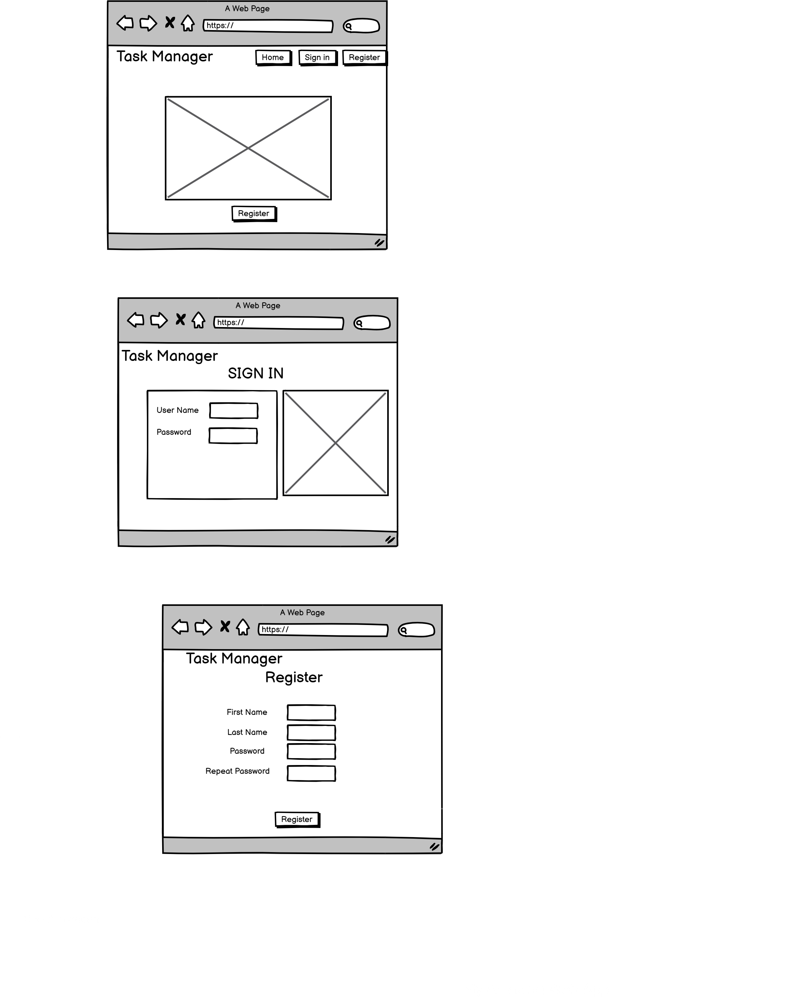
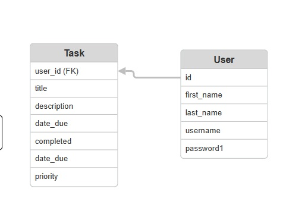

<h1 align='center'> Task Manager </h1>

View live project here: 
https://tasks-manager-6fbb1e24947a.herokuapp.com/

Welcome to Task Manager,the app you can rely on the manage you daily task and schedules. Create and account and sign in a start creating your tasks and 

## Index
* [User Experience](#user-experience-ux)
* [Features](#features)
* [Design](#design)
* [Technologies Used](#technologies-used)
* [Testing](#testing)
* [Deployment](#deployment)
* [Future Features](#future-features)
* [Credits](#credits)

## User Experience / User Stories (UX)
As a user, I want to:
- Access the Task Manager website seamlessly across various devices including desktops, laptops, tablets, and mobile phones.
- See the navigation bar contain clear and descriptive menu items that represent different actions that may be performed my on my page.
- Experience a consistent layout and design across all pages of the website, including the navigation bar's position, styling, and behavior.
- View a list of tasks I have created and their status as completed or pending
- Click to view detailed information of a task including title, description, Date Due, status, Edit buttons and delete buttons
- Create a new task by providing details such as title, description, and Date due and priority of the task.
- Modify existing Task to update information such as title, description, date due its status and priority.
- Mark mark task as completed
- Be able to delete a task

## Features
__Sign in / registration :__
Sign in for already registered users and Registration for new users

 __Navigation Bar :__
- Logo Integration for easy identification.
- Home: Directs users to the home page to introduce the user to app.
- User Registration and Sign-In Page: Allows users to create an account or sign in if already registered.

__Task listings :__
- Comprehensive details of Title, a view button, status, priority.
- Functional buttons (edit, delete) empowering users to manage Task according to their needs. The delete button only shows up for task that have been completed

__Alert messages :__
- Alert message will pop up to confirm if the user signed in or out . Also when a task is added, edited or delete.

__LogIn :__
- The login page has 2 clear options, username and password.
- If the username and password are not correct this error will show.

__Register :__
- It offers users space for a First Name, Last Name, username, email(optional), password and then rechecks the password to ensure it matches and there were no errors.

__Add Item :__
- It asks to complete fields like : Title, Description, Date due and priority

## Design

### Balsamiq wireframe
Balsamiq was used to create a low-fidelity wireframe for design purposes. The design is aimed at having a simple interface (to be improved) that allows easy navigation from one section to another by providing a navigation menu with options when user is not logged in and options for when users are logged in. A signin and  register pages with thier navation links on the navbar for quick and easy navigation to these page.
The general design patter is such that, users can interact with the application by using the navbar and other actions could be performed on the application by the items displayed under the navbar

    
    

### ERD/model

### Fonts
'Lato (google font)' is used for its combination of readability, professionalism, and widespread availability.

### Color Scheme
Colors ( white and black and sky blue ) are chosen for a clean and simple website design that keeps the focus on the content.

## Technologies Used
- __Languages__
  - HTML5
  - CSS3
  - Python/Django
  - ElephantSQL Postgres Database
  

- __Libraries & Programs Used__
  - GitHub: used for creating and maintaining the project repository.
  - Visual Studio code for development
  - GitHub Projects: used for implementing, monitoring project progress and managing tasks efficiently.
  - Balsamiq: utilised for crafting wireframes to visualise project layouts.
  - Bootstrap and Custom css: leveraged for developing visually appealing and responsive websites, tailored to project requirements.

## Testing

## Manual Testing
| **TEST** | **ACTION** | **EXPECTATION** | **RESULT** | 
|----------|------------|-----------------|------------|
| Navbar Home Link | Home link clicked | When click on it goes to the home page |Worked as expected |
| Navbar About Link | About link clicked | When click on it goes to the about page |Worked as expected |
| Navbar  Register Link | Register link clicked | Get taken to register page |Worked as expected |
| Navbar  Sign In Link | Sign in link clicked | Get taken to sign in page |Worked as expected |
| Navbar  Sign Out Link | Signout link clicked | Get taken to sign out page |Worked as expected |
| Navbar  Add Item Link | Add task link clicked | Get taken to add task page |Worked as expected |
| Sign Up Button | Clicked button | Form is submitted and go to signin page | Worked as expecte |
| Sign in Button | Clicked button | Request is submitted and go to home page of the user | Worked as expecte |
| Sign out Button | Clicked button | Request is submitted and go to logout home page | Worked as expecte |
| Add task | Clicked button | goes to the add task page | Work as expected |
| Edit Button | Clicked button | goes to Edit a task page | Work as expected |
| Delete Button | Clicked button | A task is deleted | Work as expected |
| Back to home Button | Clicked button | Go back to home page | Work as expected |

## Deployment
To deploy this page to Heroku from its repository, the following steps were taken:

- Create a new repository using the ci template.
- use fork and branch to be able of the 4 of us to work on it
- Copy the repo URL and copy it into gitpod to create a new workspace
- Install Django - add to requirements file
- Create Procfile and add guricorn
- Log in to Heroku
- Click 'New' - 'Create new app'
- Enter a name for the application and select the region
- Click 'Create App'
- Go to Settings and connect to GitHub - choose the correct repository
- Click 'Reveal config vars' and add DATABASE_URL as the key and the database URL as the value
- Go to Deploy and scroll down, click on 'Deploy Branch' to manually deploy
- Once the app has deployed, click 'Open App' at the top of the page

## Future Features
Features which could be implemented in the future:
- __Send reminder messages :__
  - Introduce a messaging systems that sends reminder messages to users

- __Search Bar :__
  - Implement a search bar functionality to enable users to  search for specific task.

- __Feedback :__
  - Survey or form to allow users to send feedback to us about bugs or future improvements we can implement in later iterations.

## Credit
- Code Institute LMS.
- Google (images)

### Author 
- [Enoh Collons](https://github.com/enocol)

